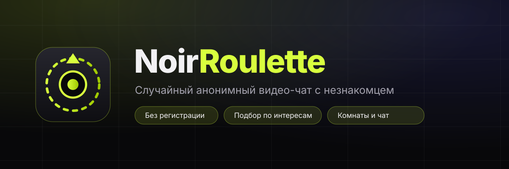
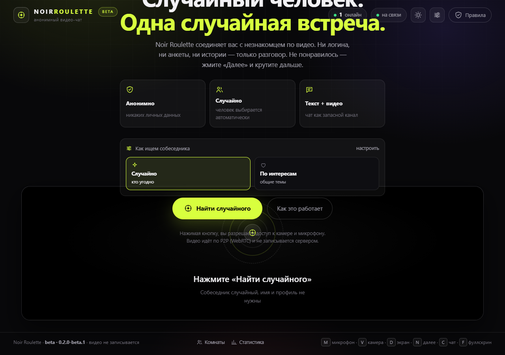
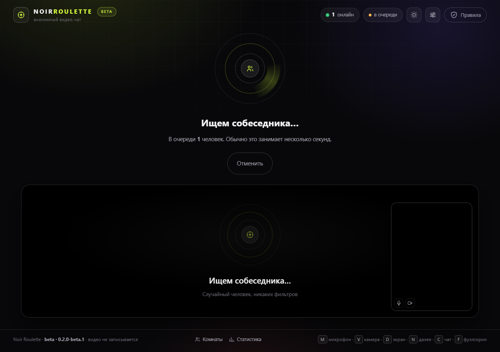
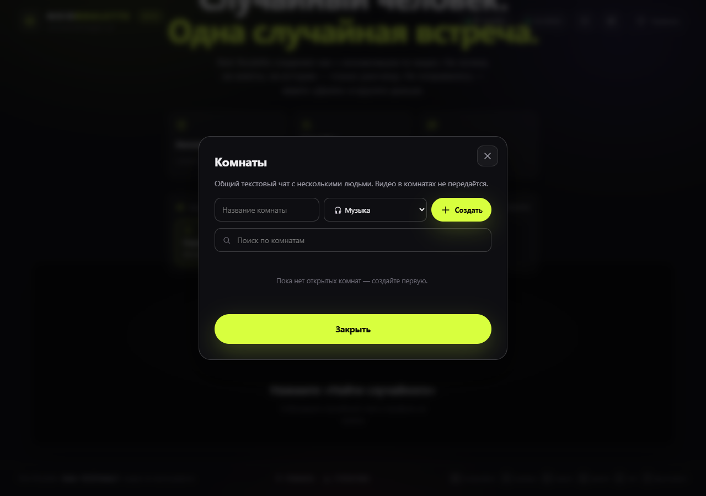
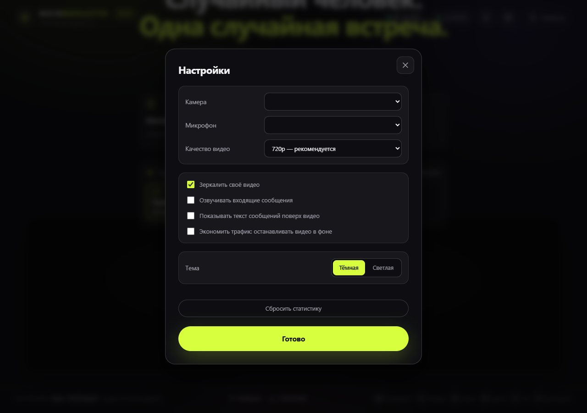
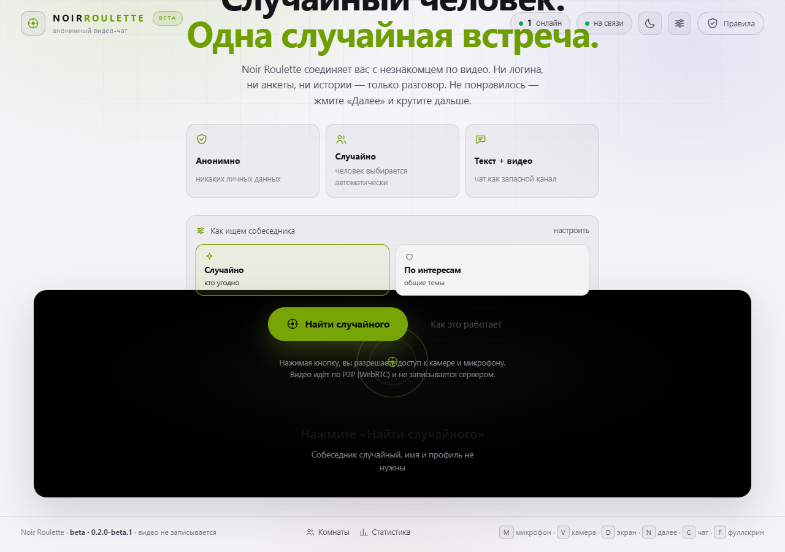

<div align="center">



# Noir Roulette

**Случайный анонимный видео-чат с незнакомцем.**
Нажал кнопку — через несколько секунд на экране другой человек.
Без регистрации, без анкет, без истории.

[](https://github.com/Ron4i/noir-roulette/releases)
[](LICENSE)
[](package.json)
[](https://github.com/Ron4i/noir-roulette/tree/ron4i-chat-roulette-full)

[Возможности](#возможности) · [Быстрый старт](#быстрый-старт) · [Скриншоты](#скриншоты) · [Telegram](#telegram) · [Протокол](#протокол-websocket-ws)

</div>

---

## Скриншоты

<div align="center">

### Главный экран



### Разговор в эфире



</div>

<details>
<summary><b>Ещё скриншоты: комнаты, настройки и светлая тема</b></summary>

| Комнаты | Настройки | Светлая тема |
| :---: | :---: | :---: |
|  |  |  |

</details>

---

## Возможности

| | Что умеет |
| --- | --- |
| 🎲 | **Случайный матч** — очередь, соединение с первым свободным человеком |
| 🧲 | **Подбор по интересам** — 27 тем, до трёх на человека, совпадение по пересечению |
| 🏠 | **Комнаты** — общий чат на несколько человек, поиск и фильтр по теме |
| 🖥 | **Демонстрация экрана** через `replaceTrack`, без пересогласования SDP |
| 📊 | **Статистика** — разговоры, минуты в эфире, средняя длительность, локальная история |
| 📶 | **Индикатор качества** — битрейт, RTT и потери пакетов в реальном времени |
| ⚙️ | **Настройки устройств** — камера, микрофон и разрешение меняются на лету |
| 💬 | **Озвучка и субтитры** — входящие сообщения можно слушать и видеть поверх видео |
| 🎨 | **Эффекты и темы** — пять фильтров камеры, тёмная и светлая тема |
| ⏭ | **«Далее»** — разрыв разговора и мгновенный возврат в очередь |
| 🚩 | **Жалоба** с причиной — соединение разрывается немедленно |
| ⚡ | **Экономия трафика** — видео останавливается, когда вкладка неактивна |

Единственное, что уходит на сервер: сигналы SDP/ICE, текст чата и отчёты о качестве.
Никаких аккаунтов, ников и переписок в базе нет — состояние живёт только в памяти процесса.

## Стек

| Слой    | Технология                                            |
| ------- | ----------------------------------------------------- |
| Клиент  | Vanilla JS (ES-модули), WebRTC, ноль фреймворков     |
| Бандлер | Vite 7                                                |
| Сервер  | Node.js 22 + Express 5 (HTTP, статика)                |
| Сигнал  | `ws` (WebSocket-транспорт для SDP/ICE и чата)         |
| Стили   | Чистый CSS, CSS-переменные, без UI-кита               |

## Быстрый старт

```bash
git clone https://github.com/Ron4i/noir-roulette.git
cd noir-roulette
npm install
npm run dev
```

Откройте <http://localhost:5173> — Vite отдаст клиент, API и WebSocket проксируются на порт `3001`.

Чтобы увидеть, как это работает, откройте **два разных браузера или одно окно + приватное окно**: соединение идёт между двумя вкладками.

### Продакшен

```bash
npm run build     # собирает клиент в dist/
npm start         # express отдаёт dist/ и WebSocket на одном порту
```

## Переменные окружения

Скопируйте `.env.example` в `.env` (или задайте переменные в окружении). Полный список с комментариями — в самом `.env.example`.

| Переменная | По умолчанию | Назначение |
| --- | --- | --- |
| `PORT` | `3001` | Порт HTTP + WebSocket |
| `HOST` | `0.0.0.0` | Интерфейс прослушивания |
| `NODE_ENV` | `development` | В `production` сервер начинает отдавать `dist/` |
| `ICE_SERVERS` | два STUN | JSON-массив ICE-серверов (см. ниже) |
| `IDLE_TIMEOUT_MS` | `600000` | Сколько живёт сессия без входящей активности |
| `HEARTBEAT_MS` | `30000` | Пинг сокетов, чтобы в очереди не копились «призраки» |
| `MEDIA_TIMEOUT_MS` | `12000` | Через сколько без медиатрека разговор считается несостоявшимся |
| `MAX_MESSAGE_CHARS` | `500` | Жёсткий лимит символов в одном сообщении |
| `CHAT_RATE_LIMIT` | `14` | Сообщений в окне ниже |
| `CHAT_RATE_WINDOW_MS` | `10000` | Окно rate-limit чата |
| `INTEREST_PICKS_PER_JOIN` | `3` | Максимум тем на один вход в очередь |
| `RANDOM_SUGGESTIONS` | `3` | Сколько случайных людей предлагать |
| `BAN_THRESHOLD` | `3` | Жалоб до временного бана |
| `BAN_DURATION_MS` | `1800000` | Длительность бана |
| `INACTIVITY_WARN_MS` | `25000` | Тишина в чате дольше этого — подозрительный разговор |
| `MAX_ROOM_GUESTS` | `8` | Максимум гостей в комнате |
| `ACCESS_MODE` | `open` | `open` или `adult` (только 18+) |

> **TURN.** По умолчанию используются публичные STUN-серверы Google. Они не помогут, если оба собеседника
> за симметричным NAT. Для публичного запуска задайте свой TURN:
>
> ```bash
> ICE_SERVERS='[{"urls":"stun:stun.l.google.com:19302"},{"urls":"turn:turn.example.com:3478","username":"u","credential":"p"}]'
> ```

`getUserMedia` требует защищённого контекста: на проде это обязательно **HTTPS**.

## Управление

| Клавиша | Действие |   | Клавиша | Действие |
| ------- | -------- | - | ------- | -------- |
| `M` | микрофон | | `C` | чат |
| `V` | камера | | `F` | полный экран |
| `D` | экран | | `R` | жалоба |
| `N` | далее | | `X` | эффекты |
| `I` | статистика | | `S` | настройки |
| `Esc` | закрыть окна | | | |

## Telegram

У проекта есть каналы: сюда выкладываем обновления, анонсы и находки.

### Канал проекта — [@noir_roulette](https://t.me/noir_roulette)

> **Noir Roulette — анонимный видеочат без регистрации**
>
> Здесь появляются все обновления площадки: новые функции, разборы багов, статусы
> серверов и анонсы релизов. Коротко, по делу, без спама.
>
> Свежие сборки — на [GitHub](https://github.com/Ron4i/noir-roulette).

### Новости и разборы — [@noir_roulette_news](https://t.me/noir_roulette_news)

> **Noir Roulette: новости и заметки**
>
> Здесь пишем длиннее: как устроен подбор, почему видео не соединяется,
> что изменилось в коде, интервью и эксперименты площадки.
>
> Если хочется коротких анонсов — [@noir_roulette](https://t.me/noir_roulette).

### Сообщения о баге — [@noir_roulette_bugs](https://t.me/noir_roulette_bugs)

> **Noir Roulette: баги и обратная связь**
>
> Нашли, что сломалось? Присылайте сюда: что делали, что ожидали, что получилось,
> браузер и ОС. Публичный баг-репорт помогает починить быстрее приватного.

Что публикуем в каждом канале:

| Канал | Формат | Периодичность |
| --- | --- | --- |
| `@noir_roulette` | Анонсы релизов, статус сервера, короткие фичи | 2–4 поста в неделю |
| `@noir_roulette_news` | Разборы, гайды по TURN и сети, длинные посты | 1–2 поста в неделю |
| `@noir_roulette_bugs` | Приём баг-репортов, статус исправлений | по мере поступления |

Готовые тексты постов, закреплёнки и план выхода лежат в [`docs/telegram/`](docs/telegram/) —
скопируйте оттуда и опубликуйте.

### Как создать свои каналы

Если хотите запустить такие же каналы от своего имени:

1. В Telegram: **Управление каналом → Создать канал** — укажите название и публичный `@handle`.
2. В описание вставьте соответствующий текст из блоков выше.
3. Поставьте аватарку из `docs/img/logo.svg` и закреплённое сообщение из `docs/telegram/`.
4. Два первых канала — на подписку, `@noir_roulette_bugs` — с обсуждениями.

Имя и `@handle` лучше выбрать свои: они не заняты только потому, что записаны здесь как пример.

## Структура

```
noir-roulette/
├── client/               # исходники фронтенда (Vite root)
│   ├── index.html        # разметка + SVG-спрайт иконок
│   ├── css/styles.css    # вся тема
│   ├── js/
│   │   ├── main.js       # состояние UI, сцены, события
│   │   ├── rtc.js        # PeerConnection, сигналы, статистика, экран
│   │   ├── signaling.js  # WebSocket с переподключением и очередью
│   │   ├── media.js      # getUserMedia, устройства, качество, ошибки
│   │   ├── store.js      # настройки, статистика, история в localStorage
│   │   └── dom.js        # мелкие хелперы и тосты
│   └── favicon.svg
├── server/
│   ├── index.js          # express + WebSocket, обработка сообщений
│   ├── config.js         # конфигурация из переменных окружения
│   ├── session.js        # сессия: состояние, настройки, совместимость
│   ├── room.js           # Matchmaker: очередь и подбор пары
│   ├── rooms.js          # комнаты и их гости
│   ├── catalog.js        # темы интересов и причины жалоб
│   └── moderation.js     # жалобы, баны, санитизация
├── scripts/
│   ├── check-protocol.js # сквозная проверка протокола двумя ботами
│   └── shot.js           # скриншоты README через headless Chrome
├── docs/
│   ├── img/              # баннер, логотип и скриншоты для README
│   └── telegram/         # готовые посты и план выхода на каналы
├── .github/              # шаблоны Issues и PR, CONTRIBUTING
├── dist/                 # сборка Vite (создаётся, в git не попадает)
└── vite.config.js
```

## Проверки

```bash
npm run lint             # ESLint
npm run build            # сборка клиента
npm run check            # lint + build

# Сквозная проверка протокола: поднимает сервер в production-режиме
# и прогоняет два бота через весь цикл разговора.
npm start                # в одном терминале
npm run check:protocol   # в другом
```

`check:protocol` проверяет handshake, очередь, матч, проксирование SDP/ICE,
чат, санитизацию, лимит длины, `media:state`, «Далее», жалобу, rate-limit и выход.
Свой адрес можно передать аргументом: `node scripts/check-protocol.js ws://localhost:3001/ws`.

Скриншоты для README переснимаются на живом сервере:

```bash
node scripts/shot.js http://localhost:3001   # положит PNG в docs/img/
```

## Протокол (WebSocket `/ws`)

**Клиент → сервер**

| Сообщение | Смысл |
| --- | --- |
| `queue:join` | встать в очередь, `prefs` — необязательный набор настроек |
| `queue:next` | разорвать пару и встать в очередь заново |
| `queue:leave` | выйти из очереди |
| `prefs` | обновить настройки подбора на лету |
| `signal` | проксировать `{kind: offer\|answer\|ice, …}` |
| `media:state` | `{mic, cam, screen}` — синхронизировать индикаторы |
| `media:ready` | «медиа пошли», снимает таймаут на видео |
| `stats:report` | `{quality}` — оценка качества для приоритета в очереди |
| `chat` | `{text}` — сообщение собеседнику |
| `report` | `{reason}` — жалоба и разрыв пары |
| `room:create` | `{title, topic}` — создать комнату |
| `room:join` | `{room}` — войти в комнату |
| `room:leave` | выйти из комнаты |
| `room:chat` | `{text}` — сообщение в комнату |
| `room:invite` | позвать собеседника в свою комнату |
| `ping` / `bye` | keepalive и выход |

**Сервер → клиент**: `ready`, `stats`, `queue:joined`, `queue:waiting`, `queue:left`, `prefs:updated`,
`match` (`{initiator, peer, iceServers}`), `signal`, `media:state`, `chat`, `peer:left`, `peer:lost`,
`report:accepted`, `banned`, `error`, `room:joined`, `room:peer:joined`, `room:peer:left`, `room:chat`,
`room:invite`, `room:invited`, `room:left`.

`peer:left` приходит с `reason`: `skipped`, `reported`, `peer_disconnected`, `left`, `no_media`.
Коды `error`: `bad_json`, `already_matched`, `private_mode`, `no_peer`, `bad_signal`, `muted`,
`rate_limited`, `room_not_found`, `room_full`, `unknown_type`.

**REST**

| Путь | Ответ |
| --- | --- |
| `GET /api/health` | `{ok, uptime, online}` |
| `GET /api/config` | `{version, iceServers, maxMessageChars, minMessageChars, accessMode, features}` |
| `GET /api/catalog` | `{topics, reasons, maxMessageChars, minMessageChars}` |
| `GET /api/stats` | `{online, waiting, chats, rooms, moderation, topics}` |

## Как помочь

Контрибьюция приветствуется — от баг-репортов до крупных фич.

- 🐛 Нашли баг → [шаблон Issue](.github/ISSUE_TEMPLATE/bug_report.md)
- 💡 Есть идея → [шаблон Issue](.github/ISSUE_TEMPLATE/feature_request.md)
- 🛠 Хотите внести правку → [CONTRIBUTING.md](.github/CONTRIBUTING.md)
- 💬 Правила общения → [CODE_OF_CONDUCT.md](.github/CODE_OF_CONDUCT.md)

## Что есть в бета, а что нет

**Есть**

- случайный матч и подбор по интересам (27 тем, до трёх на человека)
- P2P-видео/аудио, демонстрация экрана, чат, «Далее», жалоба с причиной
- комнаты с поиском, фильтром по теме и приглашением собеседника
- локальная статистика и история разговоров в `localStorage`
- выбор камеры, микрофона и разрешения; индикатор качества связи
- тёмная и светлая тема, фильтры камеры, озвучка и субтитры чата
- переподключение к серверу, heartbeat, реконнект очереди отправки
- rate-limit чата (14 сообщений / 10 с), санитизация текста на сервере
- горячие клавиши, адаптив под мобильный, `prefers-reduced-motion`

**Ограничения, о которых стоит знать**

- учётных записей нет: сервер не хранит переписки ни в каком виде
- жалобы, баны и комнаты живут только в памяти процесса — после рестарта всё обнуляется
- `ACCESS_MODE=adult` опирается на самодекларацию возраста, а не на проверку личности
- IP берётся из `X-Forwarded-For` и без доверенного проксиса ненадёжен — он нужен только для бана за грубые нарушения
- TURN-сервера в комплекте нет, за симметричным NAT соединение может не собраться

## Лицензия

[MIT](LICENSE)

## Ответственность

Проект — эксперимент. Не сообщайте незнакомцам личные данные, не записывайте разговоры без согласия собеседника.